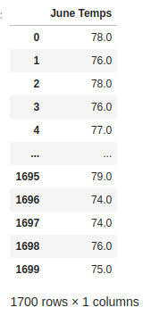
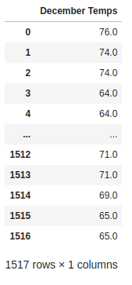
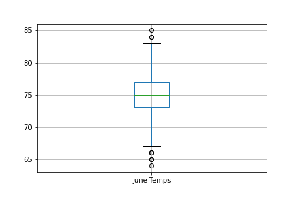
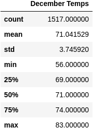
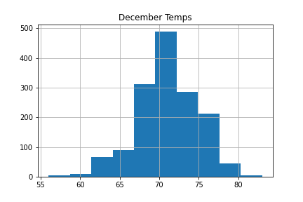
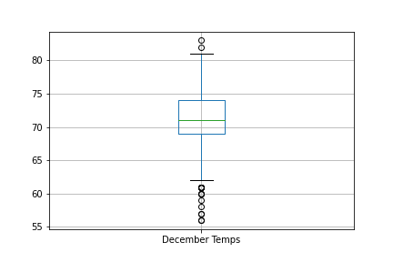

# surfs_up
Exploring weather data using Python, Pandas functions and methods, SQLite and SQLAlchemy.

## Background 
A client has requested a summary statistics on weather (specifically temperature) for the months of June and december for Oahu, HI.

## Methodology
The weather was extracted from a **SQLLite database** using **sqlalchemy**. The database contained two tables (Measurment and Stations) which were identified after reflecting the database and tables using **automap_base method** within sqlalchemy. The measurment table was queried for all June temperature and transformed into a list and then into a Pandas DataFrame. The Pandas **describe method** was used to generate summary statistics. A similar process was followed for December temperatues. Then the data was visualized using histograms, and boxplots.

## Resources
 
Data source:
- (1) hawaii.sqlite
 
Software:
- SQLite, Python 3.7.6, Visual Studio Code 1.68.1
 
 

## Findings
All the temperatures for the month of June and December converted to DataFrames as shown in Figure (a).

 

 

####  Figure (a) - DataFrames of all June and December temperatures.

 

### Results

#### June summary statistics:

- The average (mean) temperature for june in Oahu is **74.9°F**.
    - The highest temperature observed was (max) of **85.0°F**.
    - The lowest temperature observed was (min) of **64.0°F**.
    - The range of june temperatures observed was **21°F (85°F - 64°F)**.

 

(b) 

 

(c)

(d)
 
 Figure (b) June Temperatures Summary Statistics.

 Figure (c) Histtogram of June Temperatures.

 Figure (d) Boxplot of June Temperatures.

 

#### December summary statistics:

- The average (mean) temperature for june in Oahu is **71.0°F**.
    - The highest temperature observed was (max) of **83.0°F**.
    - The lowest temperature observed was (min) of **56.0°F**.
    - The range of june temperatures observed was **27°F (83°F - 56°F)**.

 

(e) 

 

(f)

(g)
 
 Figure (e) December Temperatures Summary Statistics. 

 Figure (f) Histogram of December Temperatures.

 Figure (g) Boxplot of December Temperatures.

 

## Summary
### Comparison June vs. December Temperatures
- June temperatures are (on average) about **3°F** warmer than temperatures in December.
- December temperatures are (on average) about **8°F** colder than temperatures in June.
- The range of temperatures for december is greater than June.

Two additonal queries were performed for the months of June and December to establish the most and least active stations and the average, maximum and minimum temperatures for those locations:

- The most active station was **USC00519281** with:
    - A total of **2772** data points.
    - An average temperature of **71.7°F**, a max_temp of **84.0°F**, and a min_temp of **54.0°F**.
    
- The least active station was **USC00518838** with:
    - A total of **511** data points.
    - An average temperature of **72.7°F**, a max_temp of **83.0°F**, and a min_temp of **58.0°F**.

 

## References
 
[Markdown](https://docs.github.com/en/get-started/writing-on-github/getting-started-with-writing-and-formatting-on-github/basic-writing-and-formatting-syntax)
 
[Postgresql Database Connection](https://www.postgresql.org/docs/current/libpq-connect.html)
 
[SQLAlchemy](https://www.sqlalchemy.org/)
