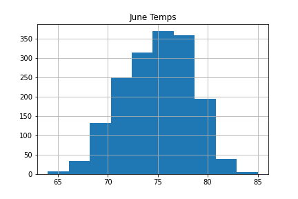

# surfs_up
Exploring weather data using SQLite, SQLAlchemy, and Flask

## Background 
A client has requested a summary statistics on weather (specifically temperature) for the months of June and december for Oahu, HI.

## Methodology
The weather was extracted from a SQLLite database using sqlalchemy. The database contained two tables (Measurment and Stations) which were identified after reflecting the database and tables using automap_base method within sqlalchemy. The measurment table was queried for all June temperature and transformed into a Pandas DataFrame. The Pandas describe method was used to generate summary statistics. A similar process was followed for December temperatues. 

## Resources
 
Data source:
- (1) hawaii.sqlite
 
Software:
- SQLite, Python 3.7.6, Visual Studio Code 1.68.1
 
 

## Findings
Stations general Information Data was collected from nine weather stations in the Oahu, HI. (Figure 1.1)

 

 

 Figure 1.1

### Results

June summary statistics:

- The average (mean) temperature for june in Oahu is 74.9 F.
    - The highest temperature observed was (max) of 85.0 F
    - The lowest temperature observed was (min) of 64.0 F
    - The range of june temperatures observed was 21 F (85 - 64)

 

 

 Figure 1.2

 

There is variability among the stations for the their avg. June temperature.

- Station USC00549397 (WAIKIKI) had the highest avg temperature for June at 77.6 F
- Station USC00516128 (MANOA LYON ARBO) had the lowest avg temperature for June at 71.9 F

 

 Figure 1.3

 

December summary statistics:

- The average (mean) temperature for june in Oahu is 71.0 F.
    - The highest temperature observed was (max) of 83.0 F
    - The lowest temperature observed was (min) of 56.0 F
    - The range of june temperatures observed was 27 F (83 - 56)

 

 

 Figure 1.2

 

There is variability among the stations for the their avg. December temperature.

- Station USC00514830 (KUALOA RANCH HEADQUARTERS) had the highest avg temperature for December at 73.2 F
- Station USC00516128 (MANOA LYON ARBO) had the lowest avg temperature for December at 69.2 F

 

 Figure 1.3

 

## Summary
### Comparison June vs. December Temperatures
- June temperatures are (on average) about 3 degrees warmer than temperatures in December.
- December temperatures are (on average) about 8 degrees colder than temperatures in June.
- The range of temperatures for december is greater.

 

## References
 
[Markdown](https://docs.github.com/en/get-started/writing-on-github/getting-started-with-writing-and-formatting-on-github/basic-writing-and-formatting-syntax)
 
[Postgresql Database Connection](https://www.postgresql.org/docs/current/libpq-connect.html)
 
[SQLAlchemy](https://www.sqlalchemy.org/)
